# KIDS MEMORY GAMES PROJECT

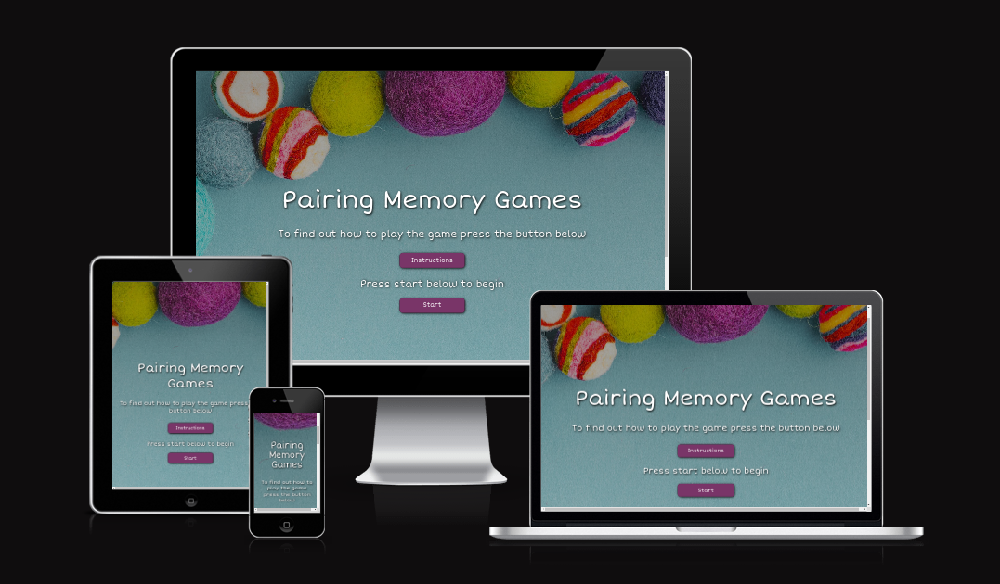 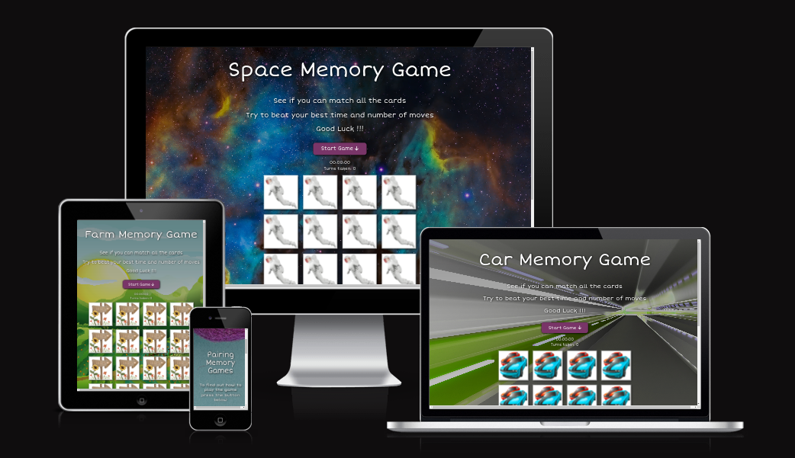

This is my first javascript project. I decieded to make the game from scratch rather than following a tutorial or a you-tube.com video so that I could gain as much knowledge about the javascript language and learn as I coded.  
I have built a card memory game that consits of three game styles, farm, space and cars. I chose these three themes as my little boy has a interest in all of them and I thought it would be fun to give him a choice when he played it. It would also be a good way to help with his memory skills and making 3 games would test my knowledge of using the DOM and what I have learnt from the Javascript modules in the code Institute course I am currently studying.

## UX

### Colour Scheme

I used colours that compliment the backgrounds and are fun for kids at the same time.

- `#ffffff` used for primary text. This gives a strong contract between the text and all 4 backrounds used on the app.
- `#793568` used for button colour as this felt neutral and a good colour choice for all game styles. Matching the landing page backround image this makes the colours feel connected. I used code from [dev.to](https://dev.to/webdeasy/top-20-css-buttons-animations-f41) by [Kocsten](https://codepen.io/kocsten) for the button animation. 

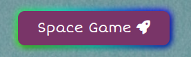

- `#6c757d` used for the instructions modal.
- `#05630a` used for winning modal to stand out from the softer colours used on the app to grab attention.
- `#000000` used for winning modal for a contrast colour for the winner modal animation.

- text-shadow: 2px 2px 8px #000000; box-shadow: 2px 2px 8px #000000; was used to make the text, buttons and cards pop and lift off the backgrounds.

I used [coolors.co](https://coolors.co/793568-6c757d-ffffff-000000-09e614) to generate my colour palette.

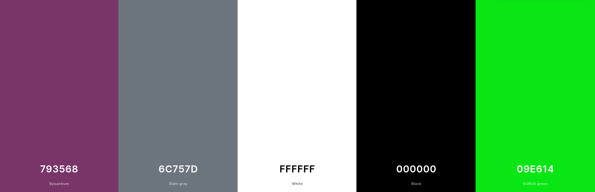

### Typography

I used Short Stack for the app font as it is a low contrast semi-geometric typeface inspired by childish written letters. It is sturdy, and clear but also whimsical and fun.

- [Short Stack](https://fonts.google.com/specimen/Short+Stack) was used for all of the text throughout the app.

- [Font Awesome](https://fontawesome.com) icons were used on the site buttons and the github icon in the footer.

## User Stories

### New Site Users

- As a new site user, I would like to read the game instructions, so that I can understand the game and what features it has.
- As a new site user, I would like to be able to choose a game style, so that I can play a game that suits my mood.
- As a new site user, I would like to be able to start a game from the game screen, so that I can begin a game of my chosen style.
- As a new site user, I would like to see a timer start when I start the game, so that I can see how fast I can complete it.
- As a new site user, I would like to see how many turns I have made as I play the game, so that I can keep track of this.
- As a new site user, I would like to be able to reset the game, timer and turns, so that I can start a new game on the same game style.
- As a new site user, I would like to be able to choose a new game style after or during playing a game, so that I can try another style.
- As a new site user, I would like to be shown my time and turns taken when I match all the cards in a game, so that I can see how well I have done.
- As a new site user, I would like to be given feedback based on how well I have done in the game, so that I can see how well I am doing.
- As a new site user, I would like to see a difference in the game styles that relate to their style, so that I feel I am playing a different game.
- As a new site user, I would like to hear a sound played when I match a card, so that I can audibly recognise this.
- As a new site user, I would like to hear sounds on button clicks, so that I can audibly recognise that they have been clicked.
- As a new site user, I would like to hear a sound related to the game when i choose a style, so that I can audibly recognise what game I am playing.
- As a new site user, I would like to hear a sound when I press the start button on a game, so that I know the game has started.
- As a new site user, I would like to hear a sound when I win the game, so that I can celebrate my win.
- As a new site user, I would like to be able to play the game on a variety of mobile devices, so that I can play on the go.
- As a new site user, I would like to play the game on different browsers, so that I can not worry about what browser I am using.

### Returning Site Users

- As a returning site user, I would like the game to play exactly the same as the last time I played it, so that I can improve my technique .
- As a returning site user, I would like to be able to play the game on a variety of different devices, so that I can play when I want.

### Site Admin

- As a site administrator, I should be able to flip all the cards to assist with matching cards & winning the game, so that I can test the app and develop new features quickly.

## Wireframes

To follow best practice, wireframes were developed for mobile, tablet, and desktop sizes.
I've used [Balsamiq](https://balsamiq.com/wireframes) to design my site wireframes.

Game Start

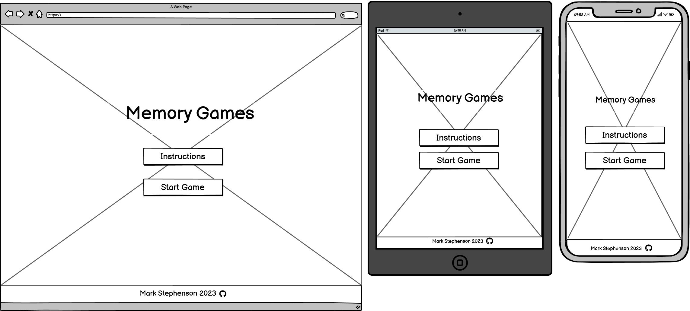

Instructions

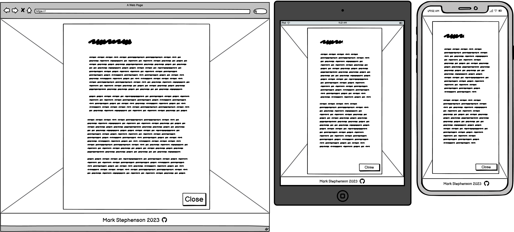

Game Style

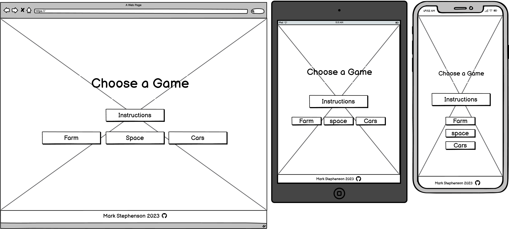

Game Page

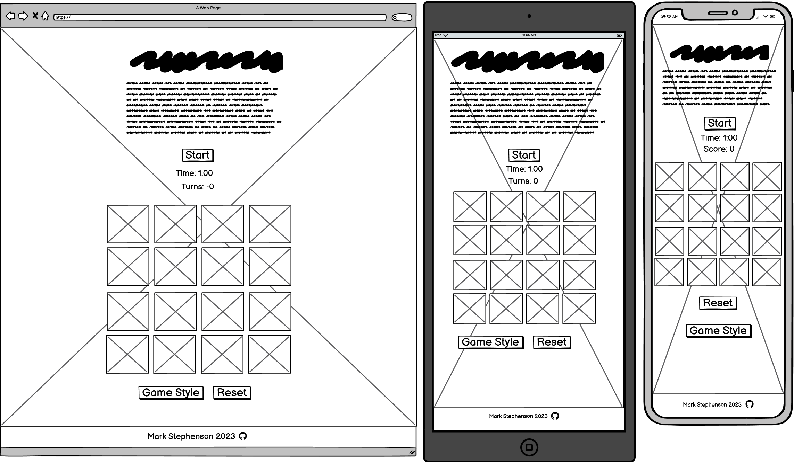

Winner Modal

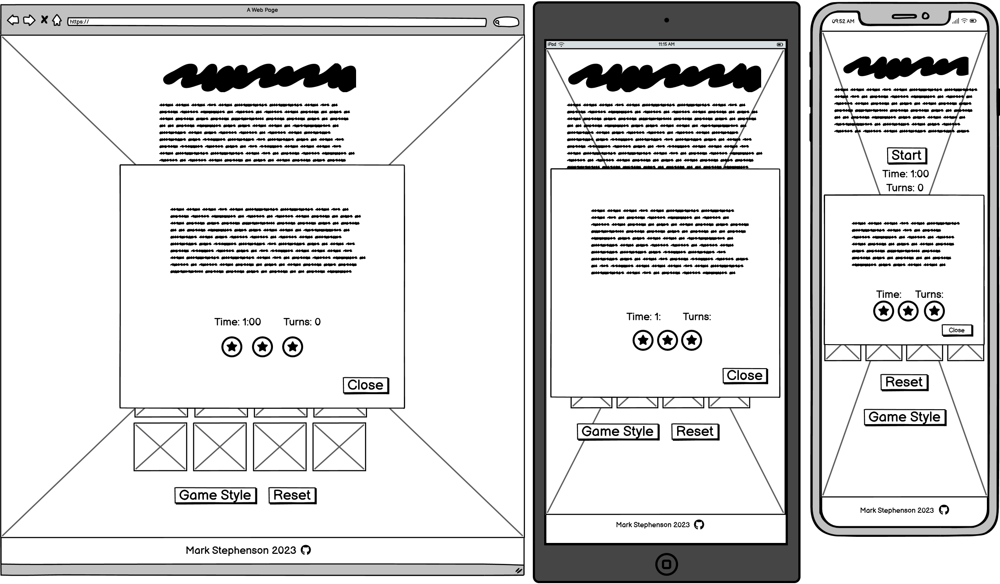

## Features

In this section, you should go over the different parts of your project,
and describe each in a sentence or so.

You will need to explain what value each of the features provides for the user,
focusing on who this website is for, what it is that they want to achieve,
and how your project is the best way to help them achieve these things.

For some/all of your features, you may choose to reference the specific project files that implement them.

IMPORTANT: Remember to always include a screenshot of each individual feature!

### Existing Features

- **Start Button**

    - Start button to get to the choose game section of the game, plays a 'pop' sound. Adds the choose game section to the DOM and hides the start button section. 

- **Instructions**

    - Instructions button with single 'pop' sound played on click that opens the bootstrap instructions modal. Modal close button plays another single 'pop' sound on click and closes the modal.

- **3 Game Style Buttons**

    - 3 Buttons that allow the user to select a game style which play a 'pop' sound on click and takes the user to that style of game.
Clicking the farm, space or car game button manipulates the DOM and hides the game header (main title), instructions section and choose game section. It then shows the game style title (**The appropriate game style name for the game you are playing is displayed**) adds the game grid (**Including the specific game cards for the chosen game style**). The game start button, timer, turns counter, reset button and new game style button are all now visible and the backround is changed to the appropriate background image.  

- **Main Game Start Button**

    - Start button that begins the game and plays a 'start the game already' vocal sound on click. This shuffles the cards, starts the timer, allows used turns to be appended to the turns counter and allows the cards to now flip when clicked. (**Cards cannot be flipped on click until this button is pressed**)

- **Reset Game Button**

    - Reset Game button plays a 'horn' sound on click. This flips all the cards back to their original position, resets the timer to 00:00:00, resets the turns counter to 0, shuffles the cards and **does not** allow any more cards to be flipped on click until the start button is clicked.

- **New Game Style Button**

    - New game style button plays a 'pop' sound on click and returns the user to . This shuffles the cards, resets the timer to 00:00:00, resets the turns counter to 0 and flips all the cards back to their original position. The background is reverted back to the main game background, the DOM is manipulated again to hide all of the game contents and now shows the main title header, instruction button and the three game buttons once more.
    (**Importantly this also clears the previous game style otherwise the game grids would not disapear and the game grids would stack ontop of each other as you switched between game styles**)

- **Game Timer #7**

    - Game timer. Starts when the Start Game button is pressed. Shows the time taken in minutes, seconds and milliseconds. Resets to 0 when the reset game, new game style or close winning modal buttons are pressed.

- **Turns Taken #8**

    - Turns Taken Counter. Increments by 1 everyime 2 cards are flipped irrelevent if the 2 cards match or not.

 

- **Match Found Sound #9**

    - 'Match Found' sound plays when a 2 cards are flipped and match.

- **Flip all Cards on Keypress**

    - Pressing 'shift' + 'r' keys on the keyboard flips all the cards to reveal their locations. Used as a developer tool or as a possible Easter Egg for the user in a future version.

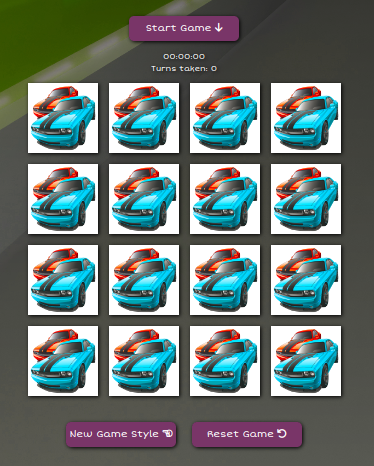  

- **Winning Modal**

    - When playing a game and 8 pairs of cards are matched the game ends and a winning modal opens with a black and green backround which toggles between the two colours. A 'winning tune' is playeded and text congratulates the user.
    The modal show the time taken from starting the game to winning, the number of turns taken and the star rating. 8 > 20 turns taken = ⭐️⭐️⭐️, 21-30 turns = ⭐️⭐️, 31-40 turns = ⭐️ and 40 > = no stars.

- **Modal Close Button**

    - Modal close button when clicked plays a 'pop' sound. This the resets the timer to 00:00:00, resets turns taken counter to 0, flips all the cards back to their original position. Also importantly it stops the user from flipping any cards until the start button is clicked again. 

 - **Footer icon with link**

    - Footer icon with link to my github repos 

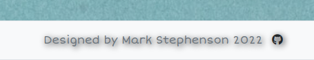

### Future Features

Do you have additional ideas that you'd like to include on your project in the future?
Fantastic! List them here!
It's always great to have plans for future improvements!
Consider adding any helpful links or notes to help remind you in the future, if you revisit the project in a couple years.

- Cool new feature #1
    - High Score Table that keeps your times, turns and star rating locally. 
- Cool new feature #2
    - Different sized game grids to increase/decrease game difficulty.
- Cool new feature #3
    - Random card generator to add images from all games to create a brand new one.
- Cool new feature #4
    - Animations on the card backgrounds whilst playing the game.  
- Cool new feature #5
    - A sound toggle to turn the sound on and off.  

## Tools & Technologies Used

In this section, you should explain the various tools and technologies used to develop the project.
Make sure to put a link (where applicable) to the source, and explain what each was used for.
Some examples have been provided, but this is just a sample only, your project might've used others.
Feel free to delete any unused items below as necessary.

- [HTML](https://en.wikipedia.org/wiki/HTML) used for the main site content.
- [CSS](https://en.wikipedia.org/wiki/CSS) used for the main site design and layout.
- [CSS :root variables](https://www.w3schools.com/css/css3_variables.asp) used for reusable styles throughout the site.
- [CSS Flexbox](https://www.w3schools.com/css/css3_flexbox.asp) and/or [CSS Grid](https://www.w3schools.com/css/css_grid.asp) used for an enhanced responsive layout.
- [Bootstrap](https://getbootstrap.com) used as the front-end CSS framework for modern responsiveness and pre-built components.
- [JavaScript](https://www.javascript.com) used for user interaction on the site.
- [JQuery](https://jquery.com/) used for getting access to a feature-rich JavaScript library.
- [Git](https://git-scm.com) used for version control. (`git add`, `git commit`, `git push`)
- [GitHub](https://github.com) used for secure online code storage.
- [GitHub Pages](https://pages.github.com) used for hosting the deployed front-end site.
- [Gitpod](https://gitpod.io) used as a cloud-based IDE for development.
- [Markdown Builder by Tim Nelson](https://traveltimn.github.io/readme-builder) used to help generate the Markdown files.

## Testing

For all testing, please refer to the [TESTING.md](TESTING.md) file.

## Deployment

The site was deployed to GitHub Pages. The steps to deploy are as follows:
- In the [GitHub repository](https://github.com/MJstephenson/KidsMemoryGame), navigate to the Settings tab 
- From the source section drop-down menu, select the **Main** Branch, then click "Save".
- The page will be automatically refreshed with a detailed ribbon display to indicate the successful deployment.

The live link can be found [here](https://mjstephenson.github.io/KidsMemoryGame)

### Local Deployment

This project can be cloned or forked in order to make a local copy on your own system.

#### Cloning

You can clone the repository by following these steps:

1. Go to the [GitHub repository](https://github.com/MJstephenson/KidsMemoryGame) 
2. Locate the Code button above the list of files and click it 
3. Select if you prefer to clone using HTTPS, SSH, or GitHub CLI and click the copy button to copy the URL to your clipboard
4. Open Git Bash or Terminal
5. Change the current working directory to the one where you want the cloned directory
6. In your IDE Terminal, type the following command to clone my repository:
	- `git clone https://github.com/MJstephenson/KidsMemoryGame.git`
7. Press Enter to create your local clone.

Alternatively, if using Gitpod, you can click below to create your own workspace using this repository.

Please note that in order to directly open the project in Gitpod, you need to have the browser extension installed.
A tutorial on how to do that can be found [here](https://www.gitpod.io/docs/configure/user-settings/browser-extension).

#### Forking

By forking the GitHub Repository, we make a copy of the original repository on our GitHub account to view and/or make changes without affecting the original owner's repository.
You can fork this repository by using the following steps:

1. Log in to GitHub and locate the [GitHub Repository](https://github.com/MJstephenson/KidsMemoryGame)
2. At the top of the Repository (not top of page) just above the "Settings" Button on the menu, locate the "Fork" Button.
3. Once clicked, you should now have a copy of the original repository in your own GitHub account!

### Local VS Deployment

Use this space to discuss any differences between the local version you've developed, and the live deployment site on GitHub Pages.

## Credits

In this section you need to reference where you got your content, media, and extra help from.
It is common practice to use code from other repositories and tutorials,
however, it is important to be very specific about these sources to avoid plagiarism.

### Content

Use this space to provide attribution links to any borrowed code snippets, elements, or resources.
A few examples have been provided below to give you some ideas.

Ideally, you should provide an actual link to every resource used, not just a generic link to the main site!

| Source | Location | Notes |
| --- | --- | --- |
| [Markdown Builder by Tim Nelson](https://traveltimn.github.io/readme-builder) | README and TESTING | tool to help generate the Markdown files |
| [Chris Beams](https://chris.beams.io/posts/git-commit) | version control | "How to Write a Git Commit Message" |
| [W3Schools](https://www.w3schools.com/howto/howto_js_topnav_responsive.asp) | entire site | responsive HTML/CSS/JS navbar |
| [W3Schools](https://www.w3schools.com/howto/howto_css_modals.asp) | contact page | interactive pop-up (modal) |
| [W3Schools](https://www.w3schools.com/css/css3_variables.asp) | entire site | how to use CSS :root variables |
| [Flexbox Froggy](https://flexboxfroggy.com/) | entire site | modern responsive layouts |
| [Grid Garden](https://cssgridgarden.com) | entire site | modern responsive layouts |
| [StackOverflow](https://stackoverflow.com/a/2450976) | quiz page | Fisher-Yates/Knuth shuffle in JS |
| [YouTube](https://www.youtube.com/watch?v=YL1F4dCUlLc) | leaderboard | using `localStorage()` in JS for high scores |

### Media

Use this space to provide attribution links to any images, videos, or audio files borrowed from online.
A few examples have been provided below to give you some ideas.

If you're the owner (or a close acquaintance) of all media files, then make sure to specify this.
Let the assessors know that you have explicit rights to use the media files within your project.

Ideally, you should provide an actual link to every media file used, not just a generic link to the main site!
The list below is by no means exhaustive. Within the Code Institute Slack community, you can find more "free media" links
by sending yourself the following command: `!freemedia`.

| Source | Location | Type | Notes |
| --- | --- | --- | --- |
| [Pexels](https://www.pexels.com) | entire site | image | favicon on all pages |
| [Lorem Picsum](https://picsum.photos) | home page | image | hero image background |
| [Unsplash](https://unsplash.com) | product page | image | sample of fake products |
| [Pixabay](https://pixabay.com) | gallery page | image | group of photos for gallery |
| [Wallhere](https://wallhere.com) | footer | image | background wallpaper image in the footer |
| [This Person Does Not Exist](https://thispersondoesnotexist.com) | testimonials | image | headshots of fake testimonial images |
| [Audio Micro](https://www.audiomicro.com/free-sound-effects) | game page | audio | free audio files to generate the game sounds |
| [Videvo](https://www.videvo.net/) | home page | video | background video on the hero section |
| [TinyPNG](https://tinypng.com) | entire site | image | tool for image compression |
| [Unsplash](https://unsplash.com/photos/7fjVzKzjni4) | main background image | image | used as the core game image
| [pngegg](https://www.pngegg.com/en/png-ppeza) | car cards background | image | used car cards

### Acknowledgements

- I would like to thank my Code Institute mentor, [Tim](https://github.com/username) for their support throughout the development of this project.
- I would like to thank the [Code Institute](https://codeinstitute.net) tutor team for their assistance with troubleshooting and debugging some project issues.
- I would like to thank the [Code Institute Slack community](https://code-institute-room.slack.com) for the moral support; it kept me going during periods of self doubt and imposter syndrome.
- I would like to thank my spouse/partner (Lucy), for believing in me, and allowing me to make this transition into software development.

