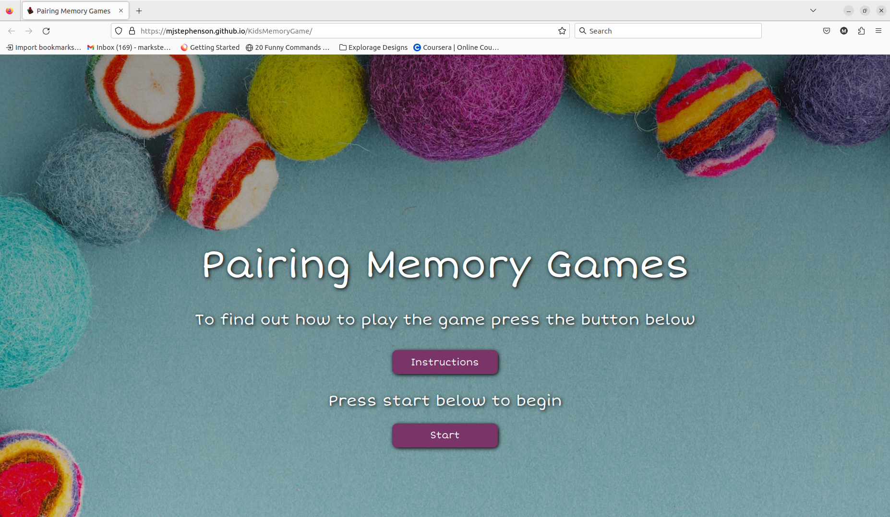

# Testing

Return back to the [README.md](README.md) file.

In this section, you need to convince the assessors that you have conducted enough testing to legitimately believe that the site works well.
Essentially, in this part, you should go over all of your project's features, and ensure that they all work as intended,
with the project providing an easy and straightforward way for the users to achieve their goals.

## Code Validation

Use the space to discuss code validation for any of your own code files (where applicable).
You are not required to validate external libraries/frameworks, such as imported Bootstrap, Materialize, Font Awesome, etc.

**IMPORTANT**: You must provide a screenshot for each file you validate.

**PRO TIP**: Always validate the live site pages, not your local code. There could be subtle/hidden differences.

### HTML

I have used the recommended [HTML W3C Validator](https://validator.w3.org) to validate all of my HTML files.
- https://validator.w3.org/nu/?doc=https%3A%2F%2Fmjstephenson.github.io%2FKidsMemoryGame%2F

### CSS

I have used the recommended [CSS Jigsaw Validator](https://jigsaw.w3.org/css-validator) to validate all of my CSS files.

- https://jigsaw.w3.org/css-validator/validator?uri=https%3A%2F%2FMJstephenson.github.io%2FKidsMemoryGame

The validator shows a warning for a Unrecognized at-rule @-webkit-keyframes. Accorning to
https://stackoverflow.com/questions/22018509/at-rule-webkit-keyframes-is-not-implemented but are not within the W3C specification and they are browser specific, so you will always have something like this when running W3C validation. The same goes for any browser specific css hacks.

### JavaScript

I have used the recommended [JShint Validator](https://jshint.com) to validate all  my JS file.

## Browser Compatibility

The game has been tested on these three browsers that I have available to me on my linux machine. The game works exactly the same accross all 3 browsers.
I tested for game wins, sounds, all features, button clicks etc. There appears to be no compatability issues.

- [Chrome](https://www.google.com/chrome)
- [Firefox](https://www.mozilla.org/firefox)
- [Opera](https://www.opera.com/download)

| Browser | Screenshot | Notes |
| --- | --- | --- |
| Chrome |  | Works as expected |
| Firefox |  | Works as expected |
| Opera |  | Works as expected |

## Responsiveness

Use this space to discuss testing the live/deployed site on various device sizes.

The minimum requirement is for the following 3 tests:
- Mobile
- Tablet
- Desktop

**IMPORTANT**: You must provide screenshots of the tested responsiveness, to "prove" that you've actually tested them.

If you have tested the project on your actual mobile phone or tablet, consider also including screenshots of these as well.
It showcases a higher level of manual tests, and can be seen as a positive inclusion!

Sample responsiveness testing documentation:

I've tested my deployed project on multiple devices to check for responsiveness issues.

| Device | Screenshot | Notes |
| --- | --- | --- |
| Mobile (DevTools) |  | Works as expected |
| Tablet (DevTools) |  | Works as expected |
| Desktop |  | Works as expected |
| XL Monitor |  | Scaling starts to have minor issues |
| 4K Monitor |  | Noticeable scaling issues |
| Google Pixel 7 Pro |  | Works as expected |
| iPhone 14 |  | Works as expected |
| x | x | repeat for any other tested sizes |

## Lighthouse Audit

**IMPORTANT**: You must provide screenshots of the results, to "prove" that you've actually tested them.

Sample Lighthouse testing documentation:

I've tested my deployed project using the Lighthouse Audit tool to check for any major issues.

| Page | Size | Screenshot | Notes |
| --- | --- | --- | --- |
| Home | Mobile |  | Some minor warnings |
| Home | Desktop |  | Few warnings |
| About | Mobile |  | Some minor warnings |
| About | Desktop |  | Few warnings |
| Gallery | Mobile |  | Slow response time due to large images |
| Gallery | Desktop |  | Slow response time due to large images |
| x | x | x | repeat for any other tested pages/sizes |

## Defensive Programming

Defensive programming was manually tested with the below user acceptance testing:

| Stage of Game | User Action | Expected Result | Pass/Fail | Comments |
| --- | --- | --- | --- | --- |
| Landing Page | | | | |
| | Click on instructions button | Modal opens, pop sound plays | Pass | |
| | Click on close button in modal | Closes modal, pop sound plays | Pass | |
| | Click on start button | Hides start button, shows game styles buttons, pop sound plays | Pass | |
| Select a Game Style Farm button| | | | |
| | Click Farm Game button | Main title header is hidden, game style buttons are hidden, Farm game title shows with text, game grid shows with farm cards showing image 1 (card back with farm sign) start game button, reset button and new game style appear. Backround image changes to farm background. Cockrel noise is played.  | Pass | |
| Select a Game Style Space button| | | | |
| | Click Space Game button | Main title header is hidden, game style buttons are hidden, Space game title shows with text, game grid shows with space cards showing image 1 (card back with spaceman) start game button, reset button and new game style appear. Backround image changes to space background. Laser noise is played.  | Pass | |
| Select a Game Style Cars button| | | | |
| | Click Cars Game button | Main title header is hidden, game style buttons are hidden, Cars game title shows with text, game grid shows with car cards showing image 1 (card back with 2 cars ) start game button, reset button and new game style appear. Backround image changes to road background. engine noise is played.  | Pass | |
| | Click Space Game button | Main title header is hidden, game style buttons are hidden, space game title shows with text, game grid shows with spaceman cards showing image 1 (card back with spaceman) start game button, reset button and new game style appear. Backround image changes to space background. Laser noise is played. | Pass | |
| | Click Car Game button | Main title header is hidden, game style buttons are hidden, car game title shows with text, game grid shows with car cards showing image 1 (card back with 2 cars) start game button, reset button and new game style appear. Backround image changes to road background. Car engine noise is played.  | Pass | |
| Main Farm/space/Car Game before the start button is clicked| | | | |
| | Click on cards | nothing happens | Pass | |
| | Timer is 00:00:00 | clicking it has no effect | Pass | |
| | Turns counter is 0 | clicking it has no effect | Pass | |
| | Reset button is clicked | Horn sound plays, no other effect to game (cards will shuffle but this is not visible) | Pass | |
| Start button clicked to start the game then reset button| | | | |
| | Click start button | Timer starts counting up correctly, sound is played | Pass | |
| | Click reset button | Timer resets to 00:00:00, user cant click and flip cards, sound is played | Pass | |
| Start button clicked to start the game and the cards are clicked| | | | |
| | Click Start game button | Timer starts, sound plays | Pass | |
| | Click on a card | Card animation flips card to an image 2  | Pass | |
| | Click the same card | Nothing happens | Pass | |
| | Click another card | Card animation flips card to an image 2, if cards dont match they stay flipped for a second then both flip back over with animation, turns counter records one turn | Pass | |
| | Click another card or a card that had been flipped previously | Card animation flips card to an image 2, | Pass | |
| | Click another card or a card that had been flipped previously | Card animation flips card to an image 2, if cards match they stay flipped. A matched sound plays and the turns counter records another turn | Pass | |
| | Click the matched cards | Nothing happens | Pass | |
| | Click another card | Card animation flips card to an image 2, | Pass | |
| | Click another card | Card animation flips card to an image 2, if cards match they stay flipped. A matched sound plays and the turns counter records another turn | Pass. | If they dont match they both flip back over. The already matched cards still both show image 2 and dont change. Clicking on these do nothing | |
| Winner modal shows when 8 pairs are found| | | | |
| | When 8 pairs of images are matched | Win Modal shows, sound is played, modal backround animation runs, shows time taken , number of turns and star rating based on number of turns | Pass | |
| | 20 turns or less | 3 stars show in modal | Pass | |
| | 21 - 30 turns | 2 stars show in modal | Pass | |
| | 30 - 40 turns | 1 stars shows in modal | Pass | |
| | click outside of modal | nothing happens | Pass | |
| | click close modal button | modal disapears, timer resets, turns counter resets, pop sound plays, user cant flip any cards until start button is pressed again | Pass | |
Click reset button at any stage in any game | | | | |
| | Click reset button | resets timer, flips all cards, resets turn counter to 0, plays horn sound shuffles cards  | Pass | |
| Dev tool | | | | |
| | Press shift + r keys.| Flips all cards in grid as expected, even when some cards have been selected and matched already | Pass | |
| New Game style button clicked from all styles of game at a random time in the game
| | Click new game style button | Game title header, start button, timer, turns counter game grid, reset button, game style button are hidden. Timer and moves counter are reset. Cards shuffle. Sound is played. Main title header is shown, instructions button and 3 game style buttons. The backround reverts ti the main game background showing the wool balls.  | Pass | |

## User Story Testing

### New Site Users
| User Story | Screenshot | Comment
| --- | --- |--- |
| As a new site user, I would like to read the game instructions, so that I can understand the game and what features it has. | |
| As a new site user, I would like to be able to start a game from the game screen, so that I can begin a game of my chosen style. |  |
| As a new site user, I would like to be able to choose a game style, so that I can play a game that suits my mood. |  |
| As a new site user, I would like to see a timer start when I start the game, so that I can see how fast I can complete it. |  |
| As a new site user, I would like to see how many turns I have made as I play the game, so that I can keep track of this. |    |
| As a new site user, I would like to be able to reset the game, timer and turns, so that I can start a new game on the same game style. |  |
| As a new site user, I would like to be able to choose a new game style after or during playing a game, so that I can try another style. |  |
| As a new site user, I would like to be shown my time and turns taken when I match all the cards in a game, so that I can see how well I have done. |  |
| As a new site user, I would like to be given feedback based on how well I have done in the game, so that I can see how well I am doing. |  |
| As a new site user, I would like to see a difference in the game styles that relate to their style, so that I feel I am playing a different game. |  |
| As a new site user, I would like to hear a sound played when I match a card, so that I can audibly recognise this. |  | 'Its a Match' sound is played. |
| As a new site user, I would like to hear sounds on button clicks, so that I can audibly recognise that they have been clicked. |     | All buttons play a sound |
| As a new site user, I would like to hear a sound related to the game when i choose a style, so that I can audibly recognise what game I am playing. |  | Buttons play a specific sound related to the game style |
| As a new site user, I would like to hear a sound when I press the start button on a game, so that I know the game has started. |  | Plays a 'Start the game already' sound |
| As a new site user, I would like to hear a sound when I win the game, so that I can celebrate my win. |  | Tune plays as game is won |
| As a new site user, I would like to be able to play the game on a variety of mobile devices, so that I can play on the go. | Works accross devices .See device responsiveness testing |
| As a new site user, I would like to play the game on different browsers, so that I can not worry about what browser I am using. | Tested on 3 browsers. See browser compatability|
| As a returning site user, I would like the game to play exactly the same as the last time I played it, so that I can improve my technique. | It works the same when a user returns |
| As a returning site user, I would like to be able to play the game on a variety of different devices, so that I can play when I want. | Tested on a variety of devices. See device testing |
| As a site administrator, I should be able to flip all the cards to assist with matching cards & winning the game, so that I can test the app and develop new features quickly. |  | Flip all cards by pressing shift + r keys|

## Bugs

Timer
- Timer kept doubling in speed when the start game button was clicked to start a new game. The timer would also start from where it previously left off from the previous game even though when the reset button was clicked it set it to 00:00:00.

    

    - To fix this, I created a gamestate in the code 0 or 1 which I could use set whether a game was running or not and used timer = null to reset the timer to zero so that the timer worked correctly.

Game Grids
- Game grids stacked ontop of each other when playing a game and then choosing another game style, then another game style.

     

    - To fix this, I wrote some code that removed the previous game grid from the DOM by removing its active class.

Sound
- Match sound kept doubling up when a match was found to create an echo of the sound as you progressed through the game.

    - To fix this, I wrote some code that would test to see if the sound was playing and would not play the matched sound if it was. This is slightly imperfect as sometimes if you get a match quickly one after the other it wont play the matched sound, but I thought that this was better than having the echo.

    

False Win
- If you got a matching pair of cards and then clicked on them again and again (rather than searching for another pair) matched cards would continue to be addded to the matched cards array until there was 16 and the game ended unfortunately. I first attacked this by writing new code that targeted the card that was last clicked and stoppping it from being clickable once it was matched. I then realised I had to do it on both so added to the code and/or the cards have class matched so that a matching cards cannot be clicked again.

    

Bad Flip
- When 2 cards were matched, and you selected another 2 - all 4 cards were flipped back over.

    

    - To fix this, I added a matched class to the cards if there was a match (the match is checked from the image-2 dataset) and then added them to the matched array and at the same time removed their active class so that they would not be flipped back over.

## Unfixed Bugs

- Playing the game on a friends iphone-x, all sounds play as they should except for the sound that is played when there is a game win and the win modal opens. This win sound plays on all other devices that I have tested so this would need further investigation as to why this sound only does not play on this event on this device.

